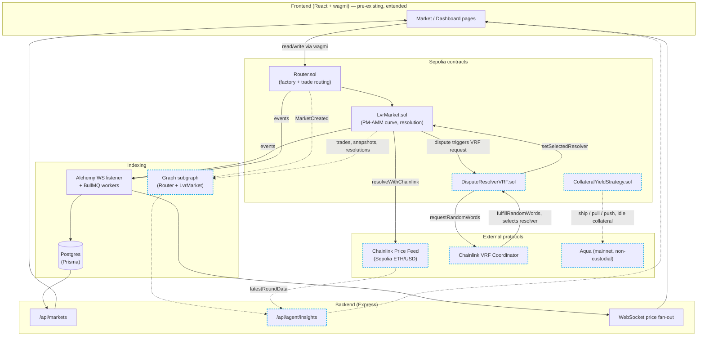

# Architecture

The original PM-AMM system (solid, pre-existing) plus the three sponsor integrations
added during ETHOnline 2026 (dashed, new). See `CONTINUITY.md` for the detailed
pre-existing/new breakdown.

## Integration points

| # | Sponsor | Where it lives | What it does |
|---|---|---|---|
| 1 | Chainlink | `LvrMarket.resolveWithChainlink()`, `DisputeResolverVRF.sol`, `CreateMarket.jsx` | Price Feeds auto-resolve objective markets (creatable via a real UI toggle, not just a contract call); VRF picks a resolver for disputed ones, replacing what was previously a dead end |
| 2 | The Graph | `subgraph/`, `backend/src/agent/insights.ts` | Subgraph indexes the same on-chain events as the Postgres pipeline; a risk-monitor agent cross-references it against integration #1's price feed to flag AMM/oracle divergence, gated to only fire near a market's deadline (see below) |
| 3 | 1inch Aqua | `contract/src/aqua/CollateralYieldStrategy.sol` | Idle post-resolution collateral can earn swap fees via a non-custodial Aqua strategy, deliberately kept isolated from the live settlement path (see below) |

Dashed nodes/edges above are new; solid ones are the pre-existing system, unmodified in
shape (only `LvrMarket`/`Router` gained new optional entry points — existing markets and
callers are unaffected).

## Two deliberate limitations, stated up front

- **The Graph's divergence flag is deadline-gated.** "AMM price vs. current oracle
  price" is only a meaningful signal once a market is close to expiring — far from the
  deadline, a rational AMM price *should* differ from a hard snapshot of the current
  price, because there's still time for it to move. The agent only flags markets within
  6 hours of their deadline; outside that window it reports the numbers without calling
  anything a mispricing.
- **1inch Aqua is not wired into `Router`/`LvrMarket`'s live redemption path.** Aqua's
  non-custodial design means a market's collateral balance shifts composition the moment
  a taker swaps against it — plugging that into the same path a user might be redeeming
  from, under a hackathon deadline, is a real fund-safety risk. `CollateralYieldStrategy`
  is fully built and fork-tested against the real deployed Aqua protocol, but kept as a
  standalone, proven capability rather than live in production.

## Live Sepolia deployment (2026-09-13)

| Contract | Address |
|---|---|
| `Router` | `0x4293d76eF16B6f947050663298B818d51A0B6DD7` |
| `DisputeResolverVRF` | `0x4CDe5b2F9e0909389B641ff38ECF3726783eD00a` |
| Sample market (admin-resolved) | `0xe2E55C29eA26A1c716779971b5E0453a3903D8Ec` |
| Sample market (Chainlink-resolved) | `0xBCF7a7c868395cF7528e869e0DDf501A0f5a53cC` |
| Subgraph | `https://api.studio.thegraph.com/query/1760225/nebula-pm/v0.0.2` |

See `CONTINUITY.md` for the full pre-existing/new breakdown and exact commit history.
