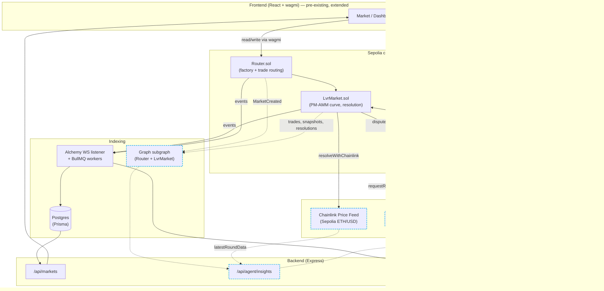

# Architecture

The original PM-AMM system (solid, pre-existing) plus the three sponsor integrations
added during ETHOnline 2026 (dashed, new). See `CONTINUITY.md` for the detailed
pre-existing/new breakdown.

## Integration points

| # | Sponsor | Where it lives | What it does |
|---|---|---|---|
| 1 | Chainlink | `LvrMarket.resolveWithChainlink()`, `DisputeResolverVRF.sol` | Price Feeds auto-resolve objective markets; VRF picks a resolver for disputed ones, replacing what was previously a dead end |
| 2 | The Graph | `subgraph/`, `backend/src/agent/insights.ts` | Subgraph indexes the same on-chain events as the Postgres pipeline; the agent cross-references it against integration #1's price feed to flag AMM/oracle divergence |
| 3 | 1inch Aqua | `contract/src/aqua/CollateralYieldStrategy.sol` | Idle post-resolution collateral can earn swap fees via a non-custodial Aqua strategy, kept isolated from the live settlement path |

Dashed nodes/edges above are new; solid ones are the pre-existing system, unmodified in
shape (only `LvrMarket`/`Router` gained new optional entry points — existing markets and
callers are unaffected).
